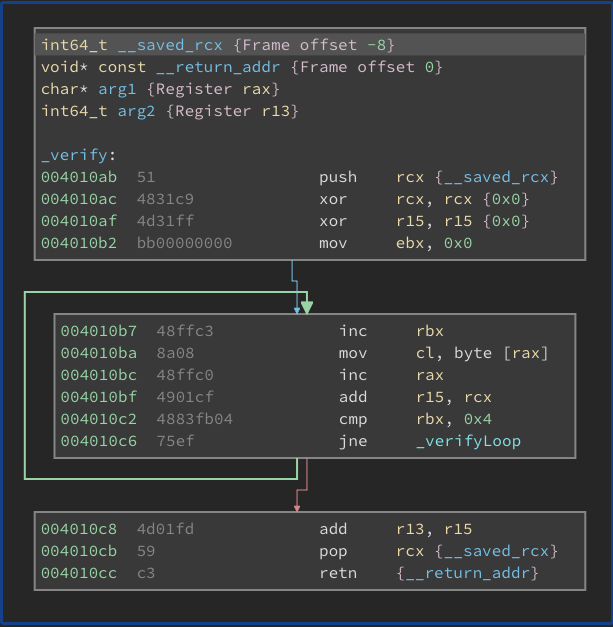
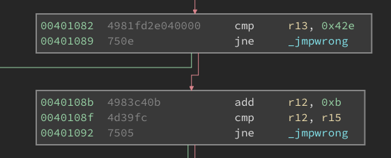

# LubimPiskoty's Personal Safe

## Challenge
Your objective is to find the password that will grant you the access message.

## Link
https://crackmes.one/crackme/5fa94bb233c5d424269a17b7

## Solution
`_verify` loop iterates always over 4 characters and does 2 things:
* store sum of characters codes in r15
* adds result (r15) to r13



This loop runs 4 times over different parts of the password. After each 2 parts code verify if sum of characters is the same. As a result characters codes (1->4, 9->12) and (5->8, 14->16) needs to be the same.

Additionally code at the end checks 2 conditions:
* sum of all characters codes in the password needs to be equal 0x42e (1070)
* difference between sum of characters codes 1->4 and 5->8 needs to be equal 0xb (11)



## Key
Manually crafted key:
```
AAACDDDEAAACDDDE
```

Key generator - [keygen.go](keygen.go)